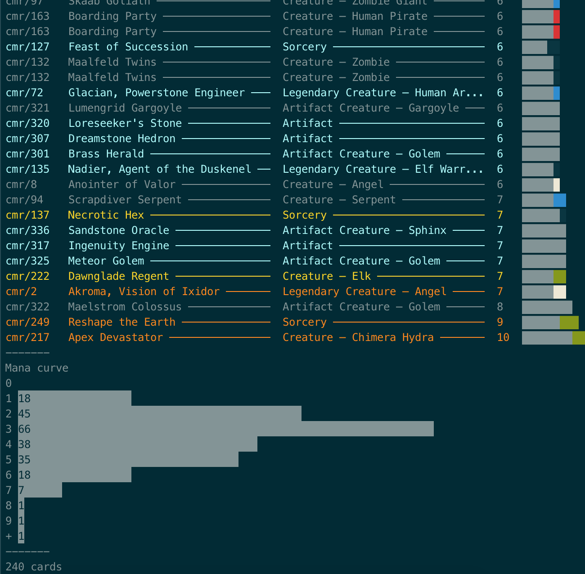

# MTG Collection Visualizer



> Requires [Python](https://www.python.org/downloads/)

## Cromebook

1. At the bottom right, select the time.
2. Select **Settings**.
3. Under "Linux (Beta)," select **Turn On**.
4. Follow the steps on the screen.
5. A terminal window opens. Follow Linux instructions below.

## Linux

1. Check for updates.

```
sudo apt-get update && sudo apt-get dist-upgrade
```

2. Install `curl`.

```
sudo apt install curl
```

3. Get the `reorder.py` script.

```
curl https://raw.githubusercontent.com/nedink/mtg-decks/master/reorder.py >> reorder.py
```

4. Allow script execution.

```
chmod +x reorder.py
```

## macOS

```
brew install python
```
---

## Create a Deck File

Deck files have one card per line, in the following format:
```
[SET CODE]/[COLLECTOR NUMBER]
```
Example:
```
znr/138
```

## Run Script
```
python3 reorder.py [DECK]
```

## Options

```
python3 reorder.py [-h] [-o ORDERBY] [-f FILTERBY] [-t] [-m] filename
```

`-o` Order By
- `name`
- `cmc`
- `type_line`
- `power`
- `toughness`


---

## Help

```
python mtg.py -h
```
