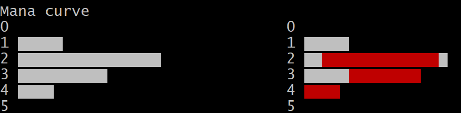

# MTG Collection Visualizer (WIP)

## Contents

- [Installation](#installation)
- [Creating Collection Files](#creating-collection-files)
- [Running the Script](#running-the-script)
- [Understanding the Output](#understanding-the-output)

> Requires [Python](https://www.python.org/downloads/). 
>
> Please note that this project is a work in progress. It has not been optimized and larger collections may take several minutes to process.

## Installation

### Python
Make sure you have python (python3) and can run it in the command line.

### Chromebook

1. At the bottom right, select the time.
2. Select __Settings__.
3. Under "Linux (Beta)," select __Turn On__.
4. Follow the steps on the screen.
5. A terminal window opens. Follow Linux instructions below.

### Linux/macOS: get the python script and example deck 

Either clone the repo, or just get the files needed to run the script. To do the latter, you 
will grab the file "examine.py" and a data file from this repo using curl:

1. Check for updates; this is good practice before installing tools.

```
sudo apt-get update && sudo apt-get dist-upgrade
```

2. Install `curl`.

```
sudo apt install curl
```

3. Get the `examine.py` script, and the example deck.

```
curl https://raw.githubusercontent.com/nedink/mtg-decks/master/examine.py >> examine.py
mkdir test-collections
curl https://raw.githubusercontent.com/nedink/mtg-decks/master/test-collections/warrior_draft_1 >> test-collections/warrier_draft_1
```

4. Allow script execution.

```
chmod +x examine.py
```

### Install `requests` module

Depending on your default environment, you may need to install the `requests` module (allows the scripts to make HTTP requests).

```
pip3 install requests
```

### Test running the code

```
examine.py test-collections/warrior_draft_1
```

Now that you can run the code, let's go on to making your own collection file and looking at options to the script.

## Creating Collection Files

Create your own collection file. 
Collection files have one card per line, in the following format:

```
[SET CODE]/[COLLECTOR NUMBER]
```

Example: 

```
znr/138
```

> The above card code represents the card [Expedition Champion](https://scryfall.com/card/znr/138/expedition-champion?utm_source=api):


## Running the script

Display a collection or a subset of a collection, filter by attribute or keyword, reorder the file if desired

```
examine.py [-h] [-o {name,cmc,type_line,power,toughness}]
[-c {W,U,B,R,G}] [-w WORDS] [-k] [-t] [-M] filename
```

### Required Arguments

`filename` 

The name of your collection file

Example:

```
python3 examine.py my_collection.txt
```

### Optional flags

`-h` (or pass no arguments)

View usage

`-c` `--color`

Filter by color identity (union operation is performed for multiple)

- `W` white
- `U` blue
- `B` black
- `R` red
- `G` green

Example: 

```
python3 examine.py my_collection.txt -c W -c U
```

`-w` `--word`

Show only cards which contain some text (intersection operation is performed for multiple)

Example:

```
python3 examine.py my_collection.txt -w pirate -w human
```

> Values for color and word filtering are case-insensitive.

`-o`, `--order-by` 

Order the output by a card attribute

- `name` the name of the card
- `cmc` the converted mana cost
- `type_line` the type line
- `power` the card's power
- `toughness` the card's toughness

> The values for `power` and `toughness` are cast to an integer. If that fails, they are interpreted as `0`.

Example: order by card name

```
python3 examine.py my_collection.txt -o name
```

`-k` `--show-keywords`

Display any common MTG words found in the type line or oracle text

> WARNING: This feature is not implemented efficiently, and may take several minutes to process for larger card collections.

`-t` `--show-text` 

Display the oracle text for each card

Example:

```
python3 my_collection.txt -t
```

> This flag only affects whether or not the oracle text is printed to the console. The absence of this flag does not affect ordering or filtering (`-w`, `--word` will still inspect each card's oracle text).

`-M` `--modify` 

Reorder entries in the collection file (the operation may fail if there are malformed entries in the file)

> WARNING: THIS WILL CAUSE THE SCRIPT TO WRITE TO YOUR COLLECTION FILE. You are encouraged to make a backup of the file before using this feature.

## Understanding the Output


The output begins (and ends) by stating the number of cards returned by your query, out of the total cards in the collection. 

The first section lists each card, with the following components in columns:

- The card identifier ("znr/138")
- The name of the card (e.g., "Expedition Champion")
- The card's type (e.g., "Creature - Human Warrior")
- The card's converted mana cost




The next section, called "Mana curve", displays information about the mana cost across the cards in the query result:

1. The converted mana cost distribution, by number of cards.
1. The converted mana cost distribution, by color identity. If a card has two colors, then it will be included twice, once for each color. 


The "Example hands" section shows a couple of randomly generated starting hands. 


The output ends with the number of cards returned by your query, and the time it took to run the script.

## Boosterize

(Under development.) When this feature is implemented, random booster packs will be created from the input collection.
